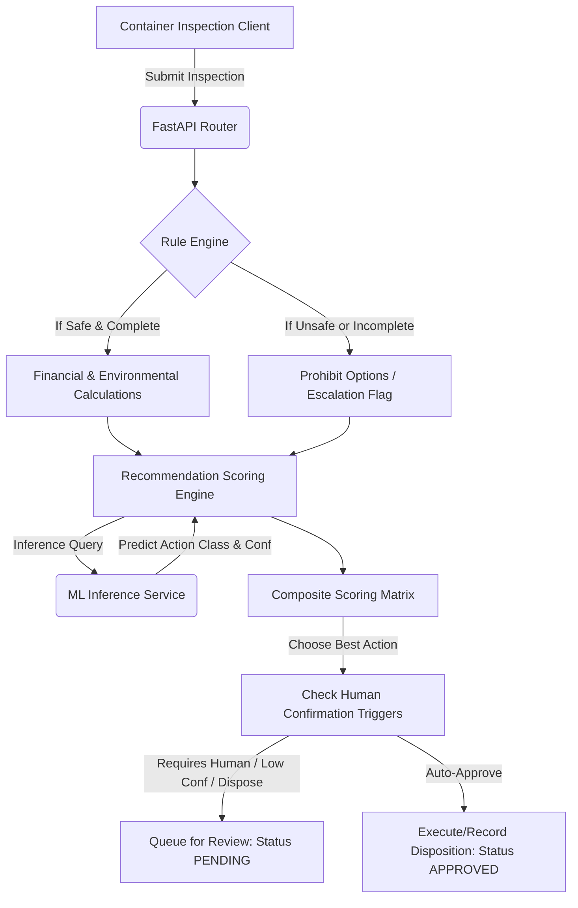

# RePackAI — Architecture & Component Design

RePackAI is designed around a clean, modular architecture separating the data layer, deterministic business rules, mathematical calculations, machine learning model prediction, and API endpoints.

## Core Components

1.  **Rule Engine (`repackai.backend.app.rules.engine`)**
    Decoupled deterministic business rules that evaluate container safety, structural conditions, and cleanliness before calculations begin. Any actions prohibited by rules are filtered out of the score search space.

2.  **Financial & Environmental Calculations (`repackai.backend.app.calculations`)**
    Formulas representing the physical metrics of the container: net financial recovery value (taking into account processing and repair costs) and environmental metrics (waste avoided and net carbon savings).

3.  **Machine Learning Service (`repackai.backend.app.services.ml_service`)**
    Loads and runs inference using the trained Random Forest Classifier pipeline, providing a probabilistic suggestion representing how operators historically resolved similar containers.

4.  **Recommendation Scoring Engine (`repackai.backend.app.services.recommender`)**
    Combines outputs from the Rule Engine, calculations, and the ML Service to compute a composite score:
    $$\text{final\_score} = 0.40 \cdot \text{financial} + 0.30 \cdot \text{environmental} + 0.20 \cdot \text{reusability} + 0.10 \cdot \text{operational}$$

5.  **Offline Fallback & Synchronization Queue (`repackai.backend.app.services.sync_service`)**
    Enables local caching of records when `network_available` is False, placing pending transactions in `SyncQueue` for replay synchronization once network connection is restored.
