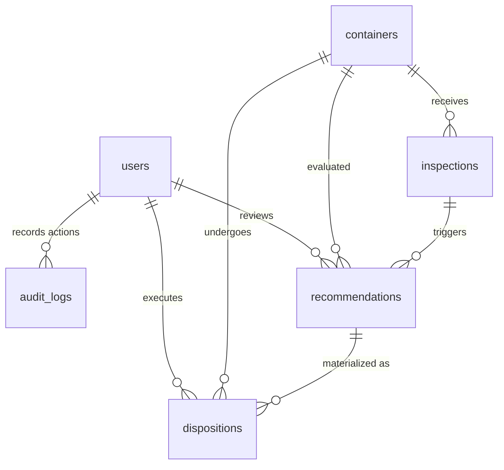

# RePackAI — Database Schema

RePackAI uses a relational schema representing the full lifecycles of reusable container classifications, operators, inspections, recommendations, final dispositions, and machine learning experiments.

## Tables & Schemas

### 1. `users`
Represents inspectors and administrators.
*   `id`: INTEGER (Primary Key)
*   `username`: VARCHAR (Unique)
*   `email`: VARCHAR (Unique)
*   `hashed_password`: VARCHAR
*   `role`: VARCHAR (default: "operator", e.g., "admin", "operator", "inspector")
*   `created_at`: DATETIME

### 2. `containers`
Base container inventory registry.
*   `id`: VARCHAR (Primary Key, e.g., "CON-10001")
*   `container_type`: VARCHAR (e.g., Box, Pallet, Crate, Drum, Tote)
*   `material`: VARCHAR (e.g., Cardboard, Wood, Plastic, Metal)
*   `weight_kg`: FLOAT
*   `age_months`: INTEGER
*   `usage_count`: INTEGER
*   `recyclable`: BOOLEAN
*   `status`: VARCHAR (default: "synced", options: "synced", "pending_sync")
*   `created_at`: DATETIME

### 3. `inspections`
Inspection findings checklist.
*   `id`: INTEGER (Primary Key)
*   `container_id`: VARCHAR (Foreign Key $\rightarrow$ `containers.id`)
*   `inspector_id`: INTEGER (Foreign Key $\rightarrow$ `users.id`, optional)
*   `damage_level`: VARCHAR (None, Low, Medium, High, Critical)
*   `structural_condition`: VARCHAR (Safe, Minor Damage, Moderate Damage, Unsafe)
*   `cleanliness_score`: FLOAT
*   `contamination`: VARCHAR (None, Organic, Chemical, Hazardous)
*   `safety_risk`: VARCHAR (Low, Medium, High)
*   `sensor_available`: BOOLEAN
*   `network_available`: BOOLEAN
*   `location_available`: BOOLEAN
*   `location`: VARCHAR
*   `inspection_completeness`: FLOAT
*   `raw_data_json`: TEXT
*   `created_at`: DATETIME

### 4. `recommendations`
Output predictions and scores from the recommender engine.
*   `id`: INTEGER (Primary Key)
*   `container_id`: VARCHAR (Foreign Key $\rightarrow$ `containers.id`)
*   `inspection_id`: INTEGER (Foreign Key $\rightarrow$ `inspections.id`)
*   `recommended_action`: VARCHAR (REPAIR, REFURBISH, RESELL, RECYCLE, DISPOSE, MANUAL_REVIEW)
*   `confidence`: FLOAT
*   `score`: FLOAT
*   `financial_score`: FLOAT
*   `environmental_score`: FLOAT
*   `reusability_score`: FLOAT
*   `operational_score`: FLOAT
*   `rules_triggered_json`: TEXT (JSON serialized list)
*   `explanation`: TEXT
*   `status`: VARCHAR (default: "PENDING", options: "PENDING", "APPROVED", "OVERRIDDEN")
*   `reviewer_id`: INTEGER (Foreign Key $\rightarrow$ `users.id`, optional)
*   `override_reason`: TEXT
*   `review_date`: DATETIME
*   `created_at`: DATETIME

### 5. `dispositions`
Historical physical operations executed on the container.
*   `id`: INTEGER (Primary Key)
*   `container_id`: VARCHAR (Foreign Key $\rightarrow$ `containers.id`)
*   `recommendation_id`: INTEGER (Foreign Key $\rightarrow$ `recommendations.id`)
*   `actual_action`: VARCHAR (REPAIR, REFURBISH, RESELL, RECYCLE, DISPOSE)
*   `processed_at`: DATETIME
*   `operator_id`: INTEGER (Foreign Key $\rightarrow$ `users.id`)
*   `notes`: TEXT
*   `actual_cost`: FLOAT
*   `actual_recovery`: FLOAT
*   `carbon_impact`: FLOAT

### 6. `material_rules`
Master processing coefficients for material types.
*   `id`: INTEGER (Primary Key)
*   `material_name`: VARCHAR (Unique)
*   `recyclable`: BOOLEAN
*   `processing_cost_per_kg`: FLOAT
*   `recycling_value_per_kg`: FLOAT
*   `carbon_recycle_per_kg`: FLOAT
*   `carbon_dispose_per_kg`: FLOAT

### 7. `disposal_rules`
Master processing multipliers for chemical/biological contamination.
*   `id`: INTEGER (Primary Key)
*   `contamination_type`: VARCHAR (Unique)
*   `disposal_cost_multiplier`: FLOAT
*   `is_hazardous`: BOOLEAN
*   `requires_special_handling`: BOOLEAN

### 8. `audit_logs`
System changes ledger for human-in-the-loop tracking.
*   `id`: INTEGER (Primary Key)
*   `user_id`: INTEGER (Foreign Key $\rightarrow$ `users.id`, optional)
*   `action`: VARCHAR
*   `entity_type`: VARCHAR
*   `entity_id`: VARCHAR
*   `old_value_json`: TEXT
*   `new_value_json`: TEXT
*   `ip_address`: VARCHAR
*   `timestamp`: DATETIME

### 9. `sync_queue`
Local cached transactions queue for offline sync.
*   `id`: INTEGER (Primary Key)
*   `entity_type`: VARCHAR
*   `entity_id`: VARCHAR
*   `payload_json`: TEXT
*   `status`: VARCHAR (PENDING, SYNCED, FAILED)
*   `retry_count`: INTEGER
*   `error_message`: TEXT
*   `created_at`: DATETIME
*   `updated_at`: DATETIME

### 10. `experiments`
ML evaluation runs.
*   `id`: INTEGER (Primary Key)
*   `name`: VARCHAR
*   `model_version`: VARCHAR
*   `parameters_json`: TEXT
*   `metrics_json`: TEXT
*   `created_at`: DATETIME
*   `created_by`: INTEGER (Foreign Key $\rightarrow$ `users.id`, optional)
