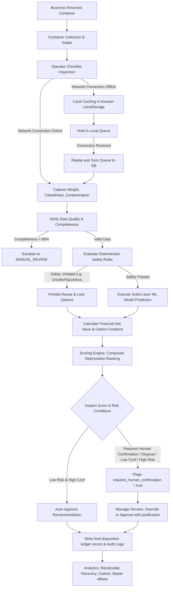

# RePackAI — Field Operations Workflow Map

This document defines the standardized operational workflow for RePackAI container routing, detailing the step-by-step handoffs between field collection, inspection, AI recommendations, manual oversight, and synchronization.

## Step-by-Step Workflow Guide

### 1. Intake & Identification
Containers are collected from clients and brought to sorting facilities. Inspectors identify each container's ID and register new items into the system.

### 2. Checklist Logging
Inspectors record damage level, structural safety, cleanliness, and biological/chemical contamination.
*   **Online Flow**: The telemetry values are synchronized with the backend.
*   **Offline Flow**: Toggling off the network caching saves the inspection in `localStorage`, maintaining operational uptime during network failures.

### 3. AI Scoring & Validation
The backend evaluates safety constraints. If the container is structurally safe and free of hazardous contamination, it runs the Random Forest model and calculates the expected financial recovery (net value) and carbon offsets.

### 4. Recommendation & Gatekeeping
*   **Low Impact Decisions**: Auto-approved and routed directly to processing.
*   **High Impact Decisions**: Escapes to `requires_human_confirmation = true`. Managers review the alternatives comparison matrix and approve or submit an override with a logged justification.

### 5. Disposition & Metric Re-calculation
Containers undergo physical processing (Resell, Repair, Refurbish, Recycle, or Dispose). Results are recorded in the audit trail ledger, updating the operations dashboards.
